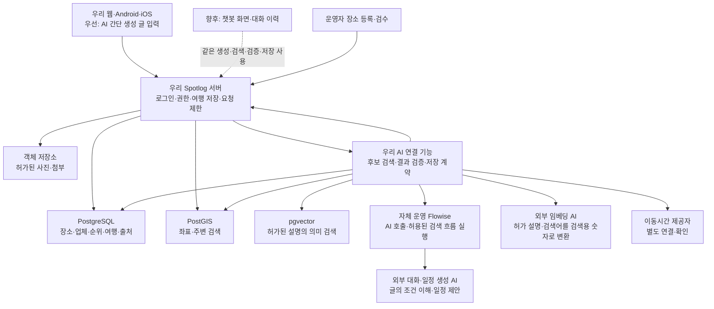

# Spotlog AI·RAG 서버 신규 구축안과 준비사항

2026-09-21 협업·배치 갱신: 사용자는 백엔드를 다른 개발자가 진행하는 동안 AI 작업을 병행하고, RAG는 **맥미니 RAM 64GB**에서 구성할 계획. 원본 장소·순위·좌표는 백엔드, 승인된 설명·검색 색인은 맥미니로 분리하는 [로컬 RAG 협업 기준](MAC_MINI_RAG_COLLABORATION_20260921.md)을 우선. 로컬 임베딩도 검증 후보이며 아래 외부 임베딩·관리형 단일 DB 배치는 초기 제안 이력. 칩·운영 여부·구체 모델·설치는 미확인/미실행.

최신 모델 정책(2026-09-21): **소형 모델 기본 · 대형 LLM은 미해결 부분만 보완**. 일정 계산·검증은 우리 서버, 모델 호출은 Flowise 경유. 데이터 부족·지도 장애는 대형 호출 대상에서 제외. 간단 생성 우선·챗봇 향후 추가 유지. [상세 호출 기준](AI_MODEL_CASCADE_20260921.md)이 아래의 단일 생성형 모델 설명보다 우선.

2026-09-20 · 조사 및 실행 제안 · 제품 코드 변경·서버 개설·유료 호출·Git 반영 없음

2026-09-21 우선순위 갱신: **AI 간단 생성의 글 입력 → 자연어 조건 인식 → 완성 일정 초안 → 상세 수정·저장 우선. 챗봇 화면·대화 세션·이어 말하기는 향후 추가.** 장소 검색·생성·검증·저장 기능은 두 진입 방식에서 공통 사용. 기존 ‘저장 장소로 추천’ 유지. [단계별 연결안](FLOWISE_CHAT_ITINERARY_PLAN_20260920.md) 참고. 현재 실제 서비스 서버·AI·네이버 연결 구현 전.

## 1. 이번 계획의 출발점

사용자 확인: **Spotlog 서비스 서버·DB·업체 순위 데이터는 신규 구축 대상.** 맥미니의 기존 Flowise와 연결된 외부 AI는 초기 간단 생성에도 재사용할 대상. Flowise는 모델·검색 호출을 연결하는 자체 운영 도구이며 챗봇 화면이나 AI 모델 자체가 아님. 장소·업체 등록과 검수, 주소·좌표 연결, 추천 기준, 실제 AI 연결을 순서대로 구축.

현재 저장소에서 확인한 것은 React 웹·Expo 앱, 로컬 저장소, 샘플 AI 어댑터와 연결 계약이다. `web/src/aiPlanner.ts`의 기본 연결은 `localAiPlannerAdapter`다. 운영 서버·DB·실제 AI/RAG 연결이 완료된 상태로 간주하지 않는다. 현재 로컬 생성 결과는 [완성 일정 우선 방향](AI_COMPLETE_ITINERARY_DIRECTION_20260920.md)에 맞춰 식사·숙박·권역 처리와 명시적 수정을 구현했다. 실제 모델/서버 연결 완료를 뜻하지 않는다.

**초기 구성안: 우리 애플리케이션 서버 + 우리 관리형 PostgreSQL + 자체 운영 Flowise + 외부 대화·일정 생성 AI + 외부 임베딩 AI.** 생성 AI는 고객 문장 이해·일정 제안, 임베딩 AI는 허가된 설명·검색어의 검색용 숫자 변환 담당. 특정 제공자·모델 미확정. 자체 모델 학습·GPU 서버부터 시작할 필요 없음. 아래 지역·수량·기술 구성은 실행 제안이며 고객 확정 구매·계약·범위 아님. 기존 [기준 일정](FIRST_RELEASE_20_WEEK_BASELINE.md) 유지.

## 2. 사용자가 먼저 준비하거나 결정할 것

| 항목 | 사용자·서비스 소유자가 정할 내용 | 개발자가 처리할 내용 | 착수에 필요한 결과 |
|---|---|---|---|
| 서비스 계정 소유자 | 고객 명의인지 개발사 명의인지, 비용 결제·최종 관리 책임자 | 개발자별 초대·최소 권한 구성 | 관리자 이메일과 비용 책임자 지정 |
| OpenAI API 계정 | API Platform 조직/프로젝트 소유권, 결제수단, 개발 월 예산 | 개발/운영 프로젝트 분리, 서버용 자격 증명·알림·한도 설정 | 개발 프로젝트에 접근 가능한 담당자, 승인된 테스트 예산 |
| 서버·DB·사진 저장소 | 클라우드 계정 소유자, 월 인프라 예산, 운영 지역 요구 | 일반 서버·관리형 DB·비공개 객체 저장소·로그·복구 구성 | 개발 환경 개설 권한과 비용 한도 |
| 도메인 | 사용할 도메인 또는 기존 도메인의 DNS 관리 담당자 | 개발 API 주소·HTTPS·운영 주소 분리 | DNS 변경 권한 또는 담당자 연락 경로 |
| 첫 검증 지역 | 한 지역과 권역 범위 선택. **제주는 제안**이며 확정 아님 | 지역별 카탈로그·동선 검증 자료 준비 | 첫 지역 한 곳 확정 |
| 데이터 확보 책임 | 자체 작성/업체 제공/이용허락된 공공자료 중 사용 경로, 검수 담당자 | 입력 양식·가져오기·중복 검사·등록 화면 | 자료 확보 방식과 검수 담당자 |
| 첫 추천 기준 | 예: 운영자 추천·랜드마크와의 거리·업종·취향 적합성. 광고의 별도 표시 여부 | 점수·정렬 규칙과 변경 이력 구현 | 초기 추천 기준 문서 |
| 서비스 판단 사례 | 원하는 여행 요청과 좋은 결과의 예시, 식사/숙소 포함·제외 기준 | 테스트 요청·자동 검사·비교 결과 작성 | 대표 요청과 기대 결과 합의 |

사용자가 좌표 변환·DB 설계·임베딩을 직접 할 필요는 없다. 사용자는 **소유권·예산·지역·자료 권리·추천 기준·검수 책임**을 정하고, 개발팀이 등록과 정제 도구를 만든다. 원자료 확보와 검수를 누가 맡을지는 반드시 지정한다. 개발자에게 데이터가 저절로 생기는 구조로 일정을 잡지 않는다.

ChatGPT/Codex 구독 사용량과 서비스에서 호출하는 API 사용료는 별도다. 이 앱의 AI 비용은 API 프로젝트에서 관리한다. API Platform은 별도 프로젝트 접근·과금을 사용하며 API 키 사용은 API 가격 체계를 따른다. [공식 계정 구분](https://learn.chatgpt.com/docs/enterprise/service-accounts), [공식 사용료 안내](https://learn.chatgpt.com/docs/pricing)

키 원문은 채팅·문서·Git·브라우저 코드에 전달하지 않는다. 권한을 받은 개발자가 서버의 비밀 저장소에 직접 넣고, 프론트는 자체 서버만 호출한다. 공식 운영 가이드도 환경변수/비밀 저장소, 키 만료·교체, 개발/운영 프로젝트 분리를 권장한다. [OpenAI 운영 가이드](https://developers.openai.com/api/docs/guides/production-best-practices)

## 3. 처음부터 필요한 구성

PostgreSQL·PostGIS·pgvector는 처음에는 같은 관리형 DB 안에 둘 수 있다. 선택할 서비스가 두 확장과 필요한 버전을 지원하는지 먼저 확인한다. AI 처리 모듈도 처음부터 별도 머신으로 분리할 필요는 없다. API와 같은 배포 단위에서 모듈을 분리하고, 실제 처리량·장시간 작업이 생기면 작업 큐와 별도 작업자로 나눈다.

현재 프론트와 타입 공유가 쉬운 TypeScript 서버를 기본 후보로 두되, 백엔드/AI 담당자의 운영 경험에 따라 최종 선택한다. 초기부터 서로 다른 서버 프레임워크 여러 개를 동시에 도입하는 것은 필수가 아니다.

외부 모델 API 방식에서는 모델 추론을 제공자에게 요청한다. 자체 서버는 권한 검사·DB 조회·요청 조합·결과 검증을 맡는다. 공식 빠른 시작이 일반 서버 환경에서 SDK로 Responses API를 호출하는 구조이므로 **이 제안에 자체 GPU 서버가 필수는 아니라는 기술적 판단**이다. 자체 모델 운영을 선택하면 별도 용량·비용 검토가 필요하다. [OpenAI 빠른 시작](https://developers.openai.com/api/docs/quickstart)

## 4. 장소 ID·순위·지도와 RAG의 역할

‘주안반점’이라는 이름만 AI에게 기억시키는 것으로 업체 연결을 해결하지 않는다. 이름이 같아도 지점이나 주소가 다르면 다른 장소다. 등록·검수로 확정한 내부 ID를 모든 화면과 자료가 함께 사용한다.

| 자료 | 기준 저장 위치·연결 방법 | 중요한 규칙 |
|---|---|---|
| 랜드마크·업체 지점 | `places.place_id` | 지도와 방문 일정이 가리키는 실제 장소 단위. ID는 서버 발급 |
| 업체 조직/브랜드 | `companies.company_id`와 장소의 선택적 연결 | 같은 브랜드의 여러 지점을 한 좌표로 합치지 않음. 랜드마크에 업체 조직을 억지로 생성하지 않음 |
| 명칭·주소·좌표 | 장소 기본정보와 변경 이력 | WGS84 위도/경도·검수 상태 저장. 좌표를 모델이 추측해서 쓰지 않음 |
| 네이버 등 외부 연결 | `place_external_refs` | 제공자·사용 가능한 외부 참조·매칭 근거·검수 상태 보관. 외부 키를 내부 기본키로 사용하지 않음 |
| 자체 추천·순위 | `place_rankings` | 장소 ID·지역/업종·기준·기준 버전·산정 시각·표본 정보 연결 |
| 설명·관광 정보 | `knowledge_documents` / `knowledge_chunks` | 장소 ID·출처·사용권·확인일·유효성·문서 버전·임베딩 모델 버전 연결 |
| 사진 | 자산 정보 + 객체 저장소 | 장소 ID·제공자·출처·표시 조건·사용권을 이미지별 관리 |
| 일정 방문 | `visits.visit_id` → `places.place_id` | 같은 장소를 두 번 방문해도 방문 ID는 각각 다름. DAY·순서·식사 역할·숙박 연결을 별도 보관 |

업체 연결은 SQL의 기본키·외래키·JOIN으로 유지한다. 외래키는 참조 대상이 실제로 존재하도록 관계 무결성을 지원한다. [PostgreSQL 제약 조건](https://www.postgresql.org/docs/current/ddl-constraints.html)

랜드마크 주변 식당은 좌표와 반경으로 후보를 먼저 찾는다. PostGIS의 `ST_DWithin`은 `geography`에 대해 미터 단위 거리 검색과 공간 인덱스 활용을 지원한다. **이 거리는 실제 도로 이동시간이 아니다.** 지도 표시·직선거리 후보 검색·자동차/대중교통 경로 계산을 서로 다른 기능으로 구현한다. [PostGIS 거리 검색](https://postgis.net/docs/ST_DWithin.html)

‘아이와 조용하게 식사할 곳’ 같은 표현에 맞는 **허가된 설명**을 찾는 부분에 의미 검색을 추가한다. 임베딩은 문서와 질문의 관련성을 검색하는 수단이며, pgvector는 PostgreSQL에서 벡터 검색을 제공한다. 따라서 초기에는 장소 DB와 같은 곳에서 필터·관계·검색을 함께 운영하는 구성이 적합하다는 제안이다. [OpenAI 임베딩](https://developers.openai.com/api/docs/guides/embeddings), [pgvector 공식 문서](https://github.com/pgvector/pgvector)

최종 응답의 업체명·주소·좌표·순위는 검색된 문장의 표현을 그대로 믿지 않고 **해당 장소 ID의 최신 DB 값으로 다시 결합**한다. 주소 변경으로 AI를 재학습하지 않는다. 모델 미세조정은 이 ID 연결 문제의 필수 조건이 아니다.

## 5. 자료가 없을 때의 초기 등록과 순위

초기 목표량의 예시는 한 지역 안에서 **랜드마크 20곳·식당 30곳·카페 10곳·숙소 10곳**이다. 확보 완료 수량이나 고객 확정 수량이 아니다. 수량 자체보다 선택한 DAY 동선에서 점심·저녁·숙박 후보가 실제로 존재하는지 확인한다. 범위가 넓은 지역은 먼저 몇 개 권역으로 제한한다.

초기 입력 양식에 필요한 항목:

- 장소명, 지점명, 종류, 지역/권역, 도로명주소, 위도·경도와 좌표 출처. 내부 ID는 시스템이 발급한다.
- 설명, 이용 목적/태그, 평균 체류시간의 근거, 확인된 운영일·시간·휴무. 모르는 값은 ‘미확인’으로 둔다.
- 음식점의 식사 역할/식단 관련 확인 정보, 숙소의 위치와 공식 정보. 실시간 예약 가능·가격은 연결된 자료가 없으면 확정하지 않는다.
- 원자료 제공자/URL, 사용 허락 범위, 사진별 출처, 확인일, 검수자, 변경 이력.
- 표시 가능·영구 저장 가능·AI 전송 가능·재배포 가능 여부를 구분한다. 특히 임베딩 API 전송도 외부 AI 전송에 포함한다.

등록 과정은 **자료 입력 → 중복/주소/좌표 확인 → 동일 장소 여부 검수 → 추천 사용 승인 → 검색 색인 생성**이다. 동명이점·주소 불일치·좌표 없음은 검수 대기 상태로 둔다. 이름만 같다는 이유로 자동 합치지 않는다. 사용자 개인 등록 장소는 본인 일정에서 쓸 수 있어도 검수 없이 공용 추천 데이터가 되지 않는다.

처음에는 이용자 행동 데이터가 없으므로 ‘인기 1위’라고 표시할 근거가 없다. 다음 두 층으로 시작한다.

1. **운영자 추천:** 서비스 소유자가 정한 기준에 따른 편집 추천. 추천 기준·대상 지역/업종·수정 시각을 기록하고 그 성격을 표시한다. 광고는 별도 표시한다.
2. **서비스 내 이용 지표:** 실제 저장·일정 담기 등 이벤트가 쌓이면 중복/비정상 이벤트를 제외하고 기간·표본을 표시한다. 최소 표본·동률 처리·산식은 수집 결과를 보고 확정한다. 표본이 부족하면 인기 순위를 만들지 않고 추천순/거리순으로 제공한다.

AI에는 순위를 발명하게 하지 않는다. 서버가 정한 필터·추천 점수·허용 후보 안에서 요청 적합성을 판단하게 한다. 추천 점수와 외부 플랫폼 평점은 다른 데이터다.

네이버 검색 결과의 조회 가능 여부가 영구 저장·RAG·모델 전송 권한까지 뜻하지 않는다. 적용 범위는 [데이터 공급·네이버 계획](../DATA_SUPPLY_AND_NAVER_PLAN.md)을 따르고 실제 계약/API 신청 시 최신 공식 조건으로 확인한다. 네이버 연결이 아직 없어도 직접 확보한 허가 데이터로 이 등록 구조와 AI 흐름을 먼저 검증할 수 있다.

## 6. 실제 여행 생성 처리 순서

1. **간단 생성의 글 인식:** 외부 대화·일정 생성 AI가 고객 문장과 간단한 보조 선택에서 지역·기간·취향·이동수단·식사/숙박 의도를 구조화. 글에 적힌 예약·포함/제외 조건도 반영. 날짜·시각·긴 옵션 목록·후보 선택을 최초 입력의 필수 과정으로 두지 않음. 필수 지역·기간이 불명확하거나 조건 충돌 시 같은 화면에서 짧게 확인. 챗봇 왕복 대화·대화 세션 없이 처리.
2. **후보 조회:** 로그인 사용자 권한을 확인한 뒤, 내부 DB에서 지역·좌표·업종·운영 상태·이용권한으로 후보를 제한한다. 저장한 장소도 같은 기준으로 권역을 검토한다. 제주·강릉·서울을 한 DAY에 조용히 합치지 않는다.
3. **설명 검색:** 필요한 경우에만 권한이 확인된 설명을 검색한다. 문서의 지시문은 시스템 지시가 아닌 자료로 취급한다. 검색 결과마다 장소 ID와 출처를 붙인다.
4. **일정 작성:** 오전 방문 → 점심 → 오후 방문 → 저녁 → 숙박처럼 요청에 맞는 초안을 생성한다. 식당의 앞뒤 방문, 식사 역할, 숙박일·다음 날 출발을 연결한다. 식사/숙박 제외 요청과 예약 숙소를 보존한다.
5. **검증:** 실제 존재하는 ID인지, DAY/기간·필수/제외·예약/고정·연결 방문을 지켰는지 서버에서 검사한다. 거리·이동시간·체류시간·영업 근거를 대조한다. 후보 부족을 가짜 업체로 채우지 않는다. 이동시간 제공자가 연결되지 않았으면 시간대를 제안하되 검증된 분 단위 동선처럼 표시하지 않는다.
6. **미리보기:** DB의 최신 장소명·주소·좌표·이미지로 카드를 구성한다. 출처·확인일·미확인 사항을 함께 보낸다. 사용자는 완성된 초안을 먼저 보고, 원할 때 점심 교체나 숙소 변경을 한다.
7. **승인·저장:** 승인한 결과만 비공개 개인 일정으로 저장한다. 수정은 원본 버전과 비교하고 중복 승인에 한 번만 반영한다. 여행기 공개는 별도 행동이다.

Responses API에서 구조화 출력은 JSON Schema 형식 준수에 사용한다. 도구 호출은 모델이 요청한 함수와 인수를 애플리케이션이 받아 실행하고 결과를 돌려주는 방식이다. **도구의 권한 검사와 실제 DB 접근은 자체 서버 책임**이다. 형식이 맞는 응답도 장소 사실과 여행 제약이 맞는지는 별도 검증한다. [구조화 출력](https://developers.openai.com/api/docs/guides/structured-outputs), [함수 호출](https://developers.openai.com/api/docs/guides/function-calling)

초기에는 서버가 후보를 정해서 전달하는 단순 흐름으로 시작할 수 있다. 필요해질 때 `find_places`, `get_place_facts`, `get_route_estimates` 등 읽기 전용 허용 함수만 추가한다. 모델에 임의 SQL·임의 URL 접근·여행 삭제·공개 발행 도구를 주지 않는다.

## 7. 서버와 프론트의 인수인계

현재 [AI 연결 계약](PHASE_3_AI_CONTRACT.md)의 `requestId`, `sourceVersion`, `sources`, `warnings`, `unplaced` 개념을 재사용한다. 식사 시간대·앞뒤 방문·숙박과 완료 일정 기준에 필요한 응답 필드는 추가 합의해야 한다. 서버가 식별자·소유권·원본 버전을 다시 확인하므로 클라이언트가 보낸 소유자/잠금 값을 그대로 신뢰하지 않는다.

초기 공통 요청에 대화 세션 ID·대화 이력 강제 없음. 간단 생성은 사용자 문장·선택 조건·저장 장소·요청 ID·필요 시 원본 여행 버전으로 처리. 향후 챗봇은 대화 맥락을 같은 요청 구조로 변환하고 공통 검색·생성·검증·저장 사용. 문장 해석·일정 작성 AI와 검색용 임베딩 AI의 역할 분리.

| 담당 | 주요 산출물 | 다음 담당자에게 넘길 완료 조건 |
|---|---|---|
| 프론트 | 간단 요청·생성 결과·DAY별 방문/식사/숙박·현재 위치를 유지한 수정·저장/실패 화면 | 샘플과 실제 서버 어댑터가 같은 구조, 닫기/다시 열기/재시도에서 초안 보존, 승인 전 원본 불변 |
| 백엔드 | 인증·장소/업체 등록·검수·좌표·추천 기준·여행/DAY/방문·사진·권한·휴지통·API | 개발 DB에 승인된 초기 자료, 서버 revision/중복 요청 처리, API 문서·오류 계약, 타인 데이터 접근 차단, DB 복구 확인 |
| AI·RAG | 요청 해석·검색·일정 생성·부분 수정·근거·검증·평가·비용 측정 | 합의한 요청 예시로 결과가 재현 가능, 미등록 업체/좌표 생성 차단, 조건 위반 응답 저장 차단, 실제 호출 비용·지연 보고 |
| 서비스/데이터 담당 | 사용 허락·검수·추천 기준·좋은 결과 판단 | 첫 지역의 권리/중복/좌표 검수 완료, 식사·숙소 기본 해석 정책 합의 |

AI가 없더라도 등록·주변 검색·저장·수동 일정은 동작해야 한다. API 한도·장애 때 기존 저장 여행을 열지 못하는 구조로 묶지 않는다. 휴지통은 기존 승인 정책인 **한국 시간 기준 6개월**을 서버 시각으로 적용하며, 복구된 여행기는 비공개다. 여행과 여행기 데이터·공유 이미지 수명은 분리한다.

## 8. 실행 순서와 기존 일정에 맞춘 점검점

| 순서 | 작업 | 완료를 판단할 실제 결과 |
|---|---|---|
| 준비 | 계정·예산·지역·데이터 검수 책임·대표 여행 요청 확정 | 개발자가 필요한 권한을 받음. 첫 자료 목록과 등록 양식이 있음 |
| 백엔드 기반 | 개발 환경·인증·DB·사진 저장·여행 저장 구축 | 계정 두 개로 데이터 분리와 저장/다시 불러오기 확인 |
| 장소 기반 | 업체/장소 등록·검수·좌표·추천 기준·주변 검색 구축 | 첫 지역 지도와 주변 후보가 실제 자료로 표시됨 |
| AI 간단 생성 연결 | 기존 Flowise 재사용·외부 생성 AI 연결·글의 조건 인식·서버 검증·응답 계약 | 챗봇 없이 한 번의 간단 생성 요청에서 프론트 미리보기까지 실제 응답 도달 |
| 검색·생성 | 허가된 설명 색인·필터·ID 결합·식사/숙박·권역·고정 일정 처리 | 후보를 사용자가 조립하지 않아도 사용할 초안 생성 |
| 변경·저장 | 방문 위치를 유지한 부분 수정·원본 버전 검사·승인 저장 | 오래된 응답/중복 승인/취소 후 도착을 막고 원본 보존 |
| 검증·운영 | 실제 요청 평가·한도·지연·오류·복구·앱 기기 테스트 | 실패와 비용을 측정한 통합 결과 및 운영 절차 |
| 향후 챗봇 | 대화 화면·대화 이력·사용자/여행별 세션·이어 말하기. 공통 검색·생성·검증·저장 재사용 | 간단 생성과 분리된 진입으로 작동. 초기 AI·RAG 완료의 필수 조건에서 제외 |

기준의 백엔드 5주가 끝날 때 **AI 검증용 초기 장소 자료와 읽기 API까지 준비**되어 있어야 다음 AI·RAG 4주를 실제 개발에 사용할 수 있다. 1월 데이터 수집은 확대·보완 기간으로 두고, 최초 검증 자료 전부를 1월로 미루지 않는다. 이것은 일정 변경이 아니라 기존 단계 간 인수인계 조건이다.

이번 변경으로 기간 변경 없음. AI·RAG 4주는 간단 생성의 실제 연결·검색·검증·상세 수정·저장에 우선 사용. 챗봇 추가 일정은 초기 생성 품질 확인 후 별도 산정.

## 9. 비용·보관·오류 기준

모델 이름과 월 요금을 지금 확정하지 않는다. 생성/질의/임베딩 모델을 설정으로 분리하고, 동일한 검증 요청으로 정확도→비용·지연 순서로 비교한다. 한국어·영어, 당일·여러 날, 음식점 제외, 예약 숙소, 자료 부족, 혼합 권역, 부분 수정, 동시 변경을 평가 자료에 포함한다. 공식 모델 선택 가이드도 목표와 평가 자료를 먼저 마련하고 정확도를 충족한 뒤 비용·지연을 최적화하도록 설명한다. [모델 선택](https://developers.openai.com/api/docs/guides/model-selection)

API 비용은 실제 입력/출력·캐시·도구 사용량을 해당 시점의 가격표에 대입한다. `월 생성 건수 × 측정한 평균 생성 비용 + 수정/질의 + 임베딩 갱신 + 서버/DB/사진/지도 비용`으로 계산한다. 초기 색인 비용과 월별 변경분 비용을 구분한다. [공식 API 가격](https://developers.openai.com/api/docs/pricing)

사용량 알림과 강제 제한은 별개다. 현재 공식 문서는 조직/프로젝트별 hard spend limit을 제공하며 초과 시 관련 요청을 429로 제한한다고 설명한다. 집계·전파가 즉시 이뤄지지 않아 설정액을 조금 넘을 수 있다. 서버에도 사용자별 호출 횟수·최대 요청 크기·동시 실행·출력 길이·재시도 한도를 둔다. [공식 지출 제한](https://developers.openai.com/api/docs/guides/spend-limits)

API 전송 자료는 명시적으로 공유를 선택하지 않는 한 모델 학습에 기본 사용되지 않는다. 그러나 **`store:false`가 어떤 자료도 보관되지 않는다는 뜻은 아니다.** 일반 응답 저장을 끄더라도 기본 남용 모니터링 로그는 최대 30일 보관될 수 있고 법적/안전상 예외, 캐시·기능별 보관 조건이 있다. Zero Data Retention은 별도 자격과 승인 조건이 있다. 선택한 모델·기능의 조건을 도입 시 다시 확인한다. [OpenAI 데이터 제어](https://developers.openai.com/api/docs/guides/your-data)

따라서 초기 요청은 필요한 조건과 허가된 후보 정보로 제한한다. 고객 이름·연락처·불필요한 여행 원문·예약번호를 모델 입력이나 운영 로그에 넣지 않는다. 자체 로그는 요청 ID·상태·시간·비용·오류 유형 위주로 남기고, 상세 평가 자료는 별도 접근권한/보관기간을 정한다. Spotlog 휴지통의 6개월과 외부 API 로그 보관기간은 서로 다른 정책이다.

## 10. 처음 실제로 보여줄 검증 결과

첫 내부 시연은 한 지역의 허가된 자료로 다음 네 요청을 비교한다.

1. ‘1박 2일, 식당도 넣고 숙소도 추천해줘’ → 식사·숙박일·앞뒤 장소가 보이는 일정.
2. ‘관광지만. 식사와 숙소는 알아서 할게’ → 업체 선택을 강요하지 않는 관광 일정.
3. ‘이 호텔은 예약했어. 카페는 빼줘’ → 확인 가능한 예약 숙소 위치를 유지하고 카페 제외.
4. 생성 결과의 상세에서 둘째 날 점심 교체 → 다른 DAY·고정 방문·숙소를 유지한 변경 전후와 승인 저장. 자유 대화로 같은 요청을 처리하는 화면은 향후 챗봇 범위.

추가로 동명이점·후보 없음·좌표 없음·다른 권역 저장·권한 없는 장소·서버 오류·중복 승인·취소·오래된 응답을 시험한다. 실제 자료가 부족한 요청은 부족하다고 표시하고 기존 초안을 보존해야 한다. 이 검증이 통과한 범위부터 확대하며, 현재 문서를 실제 서버/AI 구현 완료 보고로 사용하지 않는다.
