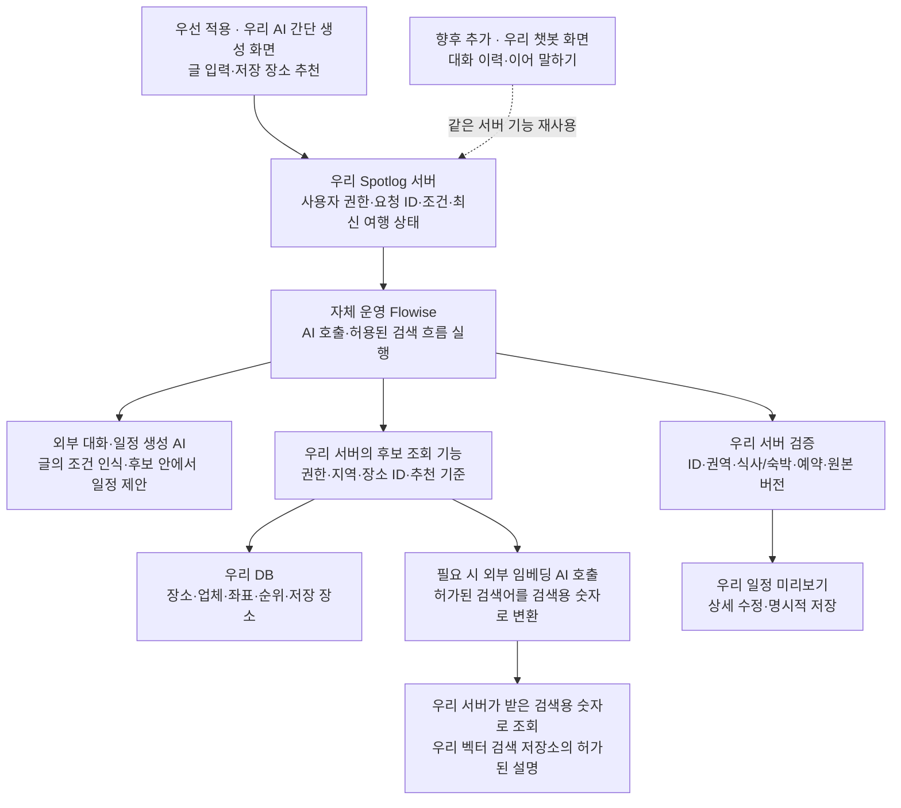

# 기존 Flowise 활용: AI 간단 생성 우선 · 챗봇 향후 추가

2026-09-21 협업 추가: 백엔드 별도 개발자와 AI 담당 병행, RAG 장비는 맥미니 RAM 64GB. 기존 Flowise를 활용하되 장소 원본과 검색 색인, 내부 요청 규격을 분리하는 [맥미니 RAG 협업 기준](MAC_MINI_RAG_COLLABORATION_20260921.md)을 우선. 칩·Flow 버전·상시 운영 여부는 확인 전.

최신 모델 정책(2026-09-21): **소형 모델 기본 · 대형 LLM은 미해결 부분만 보완**. 일정 계산·검증은 우리 서버, 모델 호출은 Flowise 경유. 데이터 부족·지도 장애는 대형 호출 대상에서 제외. 간단 생성 우선·챗봇 향후 추가 유지. [상세 호출 기준](AI_MODEL_CASCADE_20260921.md)이 아래의 단일 생성형 모델 설명보다 우선.

2026-09-21 방향 갱신 · 연결 설계 문서 · 제품 코드·맥미니 설정·Git·공개 사이트 변경 없음

## 적용 순서

**먼저 ‘AI 간단 생성’에 쓴 글을 인식해 완성 일정 초안 생성. 챗봇 화면과 이어지는 대화는 향후 추가.**

두 진입 방식의 생성·장소 검색·검증·저장은 같은 서버 기능 사용. 초기부터 챗봇 화면이나 대화 세션을 만들어야 간단 생성이 가능한 구조로 설계하지 않음. 기존 ‘저장 장소로 추천’ 유지.

| 구분 | 우선 적용: AI 간단 생성 | 향후 추가: 챗봇 진입 |
|---|---|---|
| 고객 입력 | 원하는 여행을 글로 입력 + 간단한 지역·기간·속도·이동수단 보조 선택 | 질문·답변을 이어가며 추천 장소 탐색·여행 요청 |
| 최초 결과 | 방문·식사·숙박이 배치된 완성 일정 초안 | 대화 답변·추천 장소 카드 또는 같은 형식의 일정 초안 |
| 수정 | 결과를 본 뒤 상세에서 장소 교체·추가·삭제·순서 조정 | 현재 여행을 기준으로 ‘둘째 날 점심만 바꿔줘’처럼 이어 말하기 추가 |
| 필수 기반 | 회원 권한·입력 보존·요청 ID·조건 해석·후보 검색·검증·승인 저장 | 대화 화면·사용자/여행별 대화 이력·대화 맥락·의도별 실행 구분 추가 |
| 공통 사용 | 장소 DB·허가된 RAG·일정 생성·부분 수정·검증·저장 | 왼쪽 기능 재사용. 별도의 여행 생성 엔진 중복 구축 없음 |

## 현재 확인된 환경

- 맥미니에 Flowise 설치, OpenAI·Claude 등 외부 AI 모델 연결 경험 있음. 실제 사용할 제공자·모델명 미확정.
- 신규 구축 범위: Spotlog 서비스 백엔드·회원/장소/순위/여행 DB. 기존 Flowise는 재사용 대상.
- 미확인: 접속 주소·설치 버전·Flow 이름/ID·노드 구성·Flow별 인증·서버 간 통신 경로.
- 실제 Flowise 접속·Spotlog 서버 연결·모델 호출 미실시. 현재 화면은 로컬 샘플이며 운영 AI 연결 완료 상태 아님.
- 기존 Flow의 대화 메모리 확인은 재사용 점검 항목. 초기 간단 생성에 대화 메모리·대화 세션을 필수로 추가하지 않음.

## 우선 적용할 사용자 흐름

`AI 간단 생성 열기 → 원하는 여행 입력 → 글의 지역·기간·취향·식사·숙박 의도 인식 → 장소 후보 조회 → 완성 일정 초안 → 필요한 부분만 상세 수정 → 비공개 내 여행 저장`

| 입력 예 | 처음 보여줄 결과 |
|---|---|
| 제주 2박 3일, 바다 위주로 짜줘 | 지역·기간·취향을 읽은 DAY별 초안. 적용한 조건을 결과에 표시 |
| 부모님과 부산 1박 2일, 덜 걷고 맛집도 넣어줘 | 이동 부담을 고려한 방문·식사 배치. 확인되지 않은 이동시간·접근성은 구분 표시 |
| 관광지만. 식사와 숙소는 알아서 할게 | 식당·숙소 후보 선택을 요구하지 않는 관광 일정 |
| 숙소는 이미 예약했고 카페는 빼줘 | 카페 제외, 새 숙소 추천 제외. 예약 정보가 없으면 예약 구간만 유지하고 상세에서 보완 |
| 저장한 장소로 1박 2일 만들어줘 | 저장 장소의 지역과 이동 가능 범위를 확인한 초안. 서로 다른 권역을 한 DAY에 임의 혼합하지 않음 |

초기 입력에서 날짜·도착/출발 시각·필수/제외 장소 목록·동행/접근성 등 긴 설정을 강요하지 않음. 자연어에 적힌 조건은 읽고, 추가 수정은 생성 결과의 상세에서 처리. 필수 지역·기간이 불명확하거나 보조 선택과 충돌하면 같은 입력 화면에서 짧게 확인. 대화 왕복을 필수 생성 단계로 두지 않음.

음식점·숙소는 고객 요청과 확인 가능한 데이터에 따라 포함·제외. 생성 전에 후보를 일일이 고르게 하지 않음. 결과에서 식당의 앞뒤 방문·식사 역할·숙박일을 함께 표시. 데이터 부족 시 없는 업체를 생성하지 않고 해당 구간의 미정 상태 표시.

## 연결 구조

**Flowise는 AI 모델이나 챗봇 화면이 아닌 자체 운영 실행 도구.** 초기 간단 생성에서도 기존 Flowise를 재사용해 외부 AI와 검색 도구 연결 가능. 챗봇을 나중에 붙이는 것과 Flowise를 나중에 사용하는 것은 별개.

**글의 의미·요청 조건을 읽고 일정을 제안하는 역할은 외부 대화·일정 생성 AI.** 이름에 ‘대화’가 있어도 초기에는 한 번 입력한 문장으로 생성 가능. 임베딩 AI는 허가된 문서와 검색어를 검색용 숫자로 바꾸는 역할. 사용자 의도 해석이나 완성 일정 작성 담당으로 표시하지 않음.

외부 AI 모델 방식에서 맥미니는 흐름 실행 담당. 대규모 모델 추론을 맥미니가 직접 수행하는 것으로 가정하지 않음. 개발 연결은 기존 설치 재사용, 운영 배치는 실제 이용량·가동 시간·복구 요구 확인 후 결정.

## 연결 방식과 공통 계약

- 브라우저/앱 → 우리 서버 → 인증된 Flowise → 외부 AI/우리 서버의 허용 도구 순서. 모델 키·Flowise 키는 브라우저에 넣지 않음.
- 초기 요청: 사용자 문장·간단 선택 조건·저장 장소 선택 여부·`requestId`·필요 시 원본 여행 버전. 대화 세션 ID·대화 이력은 필수 요청 항목에서 제외.
- 공통 응답: 해석된 조건·DAY/방문/식사/숙박·추천 근거·자료 부족·검증 상태·저장 가능한 초안 버전.
- 같은 서버의 권한·후보 검색·검증·저장 계약을 향후 챗봇에서도 호출. 챗봇은 대화 상태를 공통 요청 형식으로 바꾸는 진입 기능 추가.
- Flowise 호출 규격은 설치 버전과 노드 구성 확인 후 확정. 참고: [Prediction 공식 문서](https://docs.flowiseai.com/using-flowise/prediction), [Flow별 인증](https://docs.flowiseai.com/configuration/authorization/chatflow-level).
- 관리 화면 로그인과 실행 Flow 호출 인증은 구분 확인. 맥미니 외부 포트 개방은 이번 설계 작업 범위 아님.

현재 `AiPlannerAdapter.generate/revise`, `requestId`, `sourceVersion`, `dayId/visitId/anchorVisitId`, 시간대·예약·자료 부족 표현을 연결 경계로 재사용하는 안. 실제 서버 연결과 응답 필드 합의는 추가 구현 필요.

로컬 규칙 기반 해석을 운영 AI의 문장 이해 정답으로 고정하지 않음. 서버 검증 기준은 실제 장소·사용자 권한·요청 조건·예약 제약·최신 일정 버전. 늦게 도착한 응답으로 새 초안을 덮지 않고 동일 저장 요청은 한 번만 반영.

## 역할 분리

| 영역 | 우선 담당 | 향후 챗봇에서 추가할 일 |
|---|---|---|
| 우리 프론트 | 간단 입력·초안 카드·상세 수정·저장·취소·재시도·닫기/복귀 보존 | 대화 입력·응답·추천 카드·일정 미리보기 간 이동 |
| 우리 서버 | 권한·요청 상태·최신 여행 조회·장소 ID·검색·검증·승인 저장 | 사용자/여행별 대화 접근권한·대화와 현재 초안 연결 |
| 자체 운영 Flowise | 글 해석·후보 조회·일정 생성의 실행 흐름 | 답변/새 초안/부분 수정 구분, 이어 말하기 흐름 |
| 외부 대화·일정 생성 AI | 문장 조건 이해·검증된 후보 기반 일정 제안 | 이전 대화를 참조한 후속 요청 이해·추천 이유 답변 |
| 외부 임베딩 AI + 우리 검색 저장소 | 허가된 설명·검색어의 의미 검색 | 같은 검색 기능 재사용 |
| 우리 DB | 장소·주소·좌표·순위·여행·저장 기록의 기준 | 최신 여행이 대화 기억보다 우선 |

## 단계별 구현과 확인 기준

### 우선 적용: 간단 생성 완성

1. **기존 Flow 점검:** 주소·버전·모델·노드·인증 확인. 기존 Flow 보존, Spotlog용 흐름 별도 구성.
2. **문장 입력 연결:** 간단 생성의 글·보조 조건을 우리 서버가 Flowise에 전달. 한 요청의 조건 해석·응답 수신 확인. 실패 시 입력 보존.
3. **완성 초안 연결:** 한 권역의 허가된 실제 장소 후보로 DAY·방문·식사·숙박 생성. 내부 ID·권역·예약·자료 부족을 서버에서 검증하고 기존 카드로 표시.
4. **상세 수정·저장:** 결과를 본 뒤 장소 교체·추가·삭제·순서 조정. 기존 여행은 승인한 버전만 저장. 닫기/재진입·중복 저장·오래된 응답 처리 확인.
5. **운영 검수:** 실제 요청 평가·지연·비용·연결 단절·맥미니 재시작·동시 생성·Android/iOS 복귀 확인.

초기 완료 기준: **챗봇 없이 간단 생성에 글을 쓰면 조건을 읽은 초안이 나오고, 상세 수정 후 내 여행으로 저장 가능.** 현재는 해당 연결 구현 전.

### 향후 확장: 챗봇 추가

1. 챗봇 진입 화면·대화 이력·사용자/여행별 세션 추가.
2. 여행지 질문에 추천 장소 카드와 찜 기능 연결.
3. ‘일정으로 만들어줘’ 요청을 기존 간단 생성과 같은 생성 기능에 전달.
4. ‘둘째 날 점심만 바꿔줘’ 같은 후속 요청을 공통 부분 수정 기능에 연결. 대상 밖 방문·예약 보존.
5. 수동 수정 후 최신 여행 기준 대화, 사용자 간 대화 분리, 대화 복귀·보관 기준 검수.

챗봇은 초기 AI·RAG 완료의 필수 조건에서 분리. **기존 AI·RAG 4주 일정은 변경하지 않고 간단 생성의 실제 연결·검색·검증·저장 완성에 우선 사용.** 챗봇 추가 일정은 초기 결과 확인 후 별도 산정.

## 다음 연결 점검에 필요한 정보

평소 여는 Flowise 주소·사용할 Flow 이름·설치 버전(알면) 확인 필요. API 키·비밀번호는 채팅으로 전달하지 않고 개발 서버 비밀 저장소에 설정. 맥미니 사양만으로 외부 AI 응답 속도나 서비스 처리량을 확정하지 않음.

[AI·네이버 신규 구축 안내](AI_NAVER_START_GUIDE_20260920.md) · [AI·RAG 상세안](AI_RAG_IMPLEMENTATION_20260920.md)
