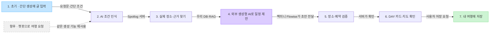
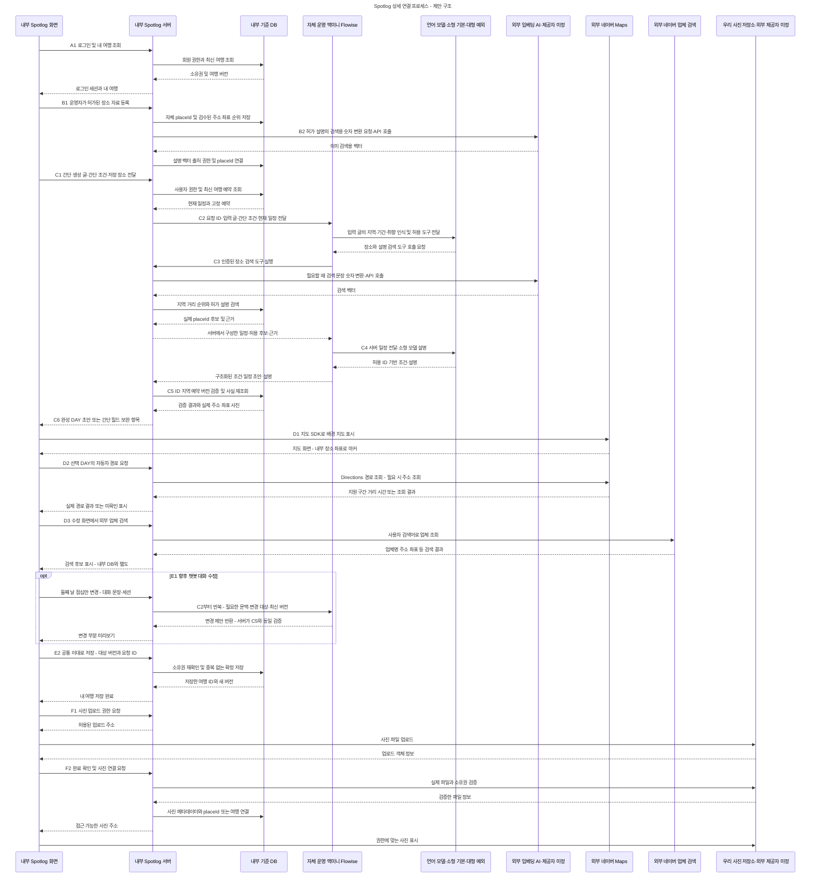

# Spotlog 시스템 연결도 — 개념·기술 상세·고객 여정·전체 구성

최신 모델 정책(2026-09-21): **소형 모델 기본 · 대형 LLM은 미해결 부분만 보완**. 일정 계산·검증은 우리 서버, 모델 호출은 Flowise 경유. 데이터 부족·지도 장애는 대형 호출 대상에서 제외. 간단 생성 우선·챗봇 향후 추가 유지. [상세 호출 기준](AI_MODEL_CASCADE_20260921.md)이 아래의 단일 생성형 모델 설명보다 우선.

[전체 11장 목차·역할·연결 기준 — 00~10](SYSTEM_DIAGRAM_SET_20260921.md)

2026-09-21 최신 방향: **초기에는 ‘AI 간단 생성’에 쓴 글을 인식해 완성 일정 초안 생성. 챗봇은 향후 별도 대화 진입점으로 추가.** 두 진입점은 같은 장소 검색·일정 생성·검증·저장 기능 재사용. 기존 챗봇 우선 연결안보다 이 순서 우선. 현재 간단 생성 화면을 유지하는 연결 설계이며 실제 외부 AI 연동 완료를 뜻하지 않음.

2026-09-21 추가: 같은 보드에 [00 시스템 전체 구성도](https://www.figma.com/board/8IageUvocd3SaddRKOoCGi?node-id=21-379) 한 장 추가. 현재 보드 맨 왼쪽 배치와 00 번호 유지. 화면·서비스 접속·Spotlog 서버·맥미니 Flowise·DB·사진 저장소·외부 생성형 AI·외부 임베딩 AI·네이버·허가 자료 연결과 준비 상태 표시. [구성·연결 기록](SYSTEM_OVERVIEW_20260921.md). 기존 세 도면 보존.

2026-09-21 고객 여정 개정: 가입 → 발견·장소 탐색 → 찜 → AI 간단 생성 → 상세 다듬기 → 여행기 등록 → 추천·스레드. 챗봇 추천은 향후 추가 진입점으로 분리한 [고객 여정별 상세 연결도](https://www.figma.com/board/8IageUvocd3SaddRKOoCGi?node-id=15-379). 기존 도면 링크 유지. [단계별 연결 기록](CUSTOMER_JOURNEY_CONNECTIONS_20260921.md).

2026-09-20 · 제안 구조 · 2026-09-21 메모체·내부/외부 연결 명칭 정리

[FigJam 개념도](https://www.figma.com/board/8IageUvocd3SaddRKOoCGi?node-id=5-262) / [상세 연결도](https://www.figma.com/board/8IageUvocd3SaddRKOoCGi?node-id=4-34) · 같은 보드에 구성 · 두 도면 이미지 확인 완료
수정 범위: 도면 문구·설명 문서 · 기존 제품 코드·맥미니 설정·Git·공개 사이트 변경 없음

## 1. 개념도 — 한 문장으로 요청 → 검증된 일정 제안

### 역할을 읽는 법

| 이름 | 맡는 일 | 준비 상태 |
|---|---|---|
| Spotlog 화면 | 발견·저장·AI 간단 생성·DAY 카드·지도 | React 웹·Expo WebView 앱 시제품 있음. 초기 실제 AI 연결은 기존 간단 생성 화면부터 |
| 향후 챗봇 | 사용자가 여행 추천과 수정 요청을 대화로 이어가는 별도 진입점 | 간단 생성 안정화 이후 추가. 공통 검색·생성·검증·저장 기능 재사용 |
| API — 연결 방식 | 화면·서버·Flowise·외부 서비스가 요청과 결과를 주고받는 창구 | 제품명·AI 종류·내부/외부 구분을 뜻하지 않음. 연결 대상과 함께 표기 |
| Spotlog 서버 | 로그인·권한·현재 여행·장소 조회·추천 기준·검증·저장 | 신규 구축 |
| 우리 DB | 실제 장소·업체·주소·좌표·순위·회원·여행의 기준. 향후 대화 기록 연결 | 신규 구축. PostgreSQL + PostGIS + pgvector 권장 |
| 맥미니 Flowise — 자체 운영 도구 | 외부 AI 호출과 서버 검색 도구 실행을 이어주는 연결 도구. AI 모델·챗봇 화면 아님 | 맥미니에 설치됨. 초기 간단 생성에도 활용 가능, Spotlog 연결 전 |
| 외부 생성형 AI · 문장 인식·일정 생성 | 초기: 입력 글의 조건 인식·일정 생성. 향후: 같은 AI에 대화 문맥·답변 기능 연결 | 기존 외부 모델 연결 있음. 정확한 제공자·모델 미확인 |
| RAG | 사용 허가된 설명을 찾아 AI가 참고하도록 제공 | 신규 구성. 업체 ID나 좌표를 학습시키는 기능이 아님 |
| 외부 임베딩 AI | 설명과 검색 문장을 검색용 숫자로 변환. 관련 자료 검색을 돕는 AI 모델 | 제공자 미정. 생성형 모델과 별도 선택, 우리 서버에서 API로 호출 예정 |
| 외부 네이버 Maps | 지도 화면과 지원되는 자동차 경로·주소 조회 | 연결 예정. 현재는 MapLibre/OSM 기반 샘플 지도 |
| 외부 네이버 API HUB 검색 | 사용자가 식당·숙소 등을 찾을 때 외부 검색 후보 표시 | Maps와 별도 서비스·키로 연결 예정 |
| 우리 사진 저장소 | 실제 이미지 파일 보관과 전달. 외부 저장소 서비스를 선택해 운영할 대상 | 제공자 미정. 파일은 우리 서비스 데이터, DB에는 파일 연결 정보 저장 |

### 내부·자체 운영·외부 표기 기준

- 내부: Spotlog 화면·서버·DB. 우리 서비스 기능과 기준 데이터
- 자체 운영 도구: 맥미니 Flowise. 외부 AI와 내부 검색 도구의 실행 순서를 연결하는 도구
- 외부 AI: 생성형 AI / 임베딩 AI. 생성형 AI는 문장 인식·일정 생성, 임베딩 AI는 의미 검색용 변환 담당. 같은 제공자 사용 가능
- 외부 일반 서비스: 네이버 지도·업체 검색, 선택 예정인 사진 저장소 공급 서비스
- 사진 저장소: 논리적으로 우리 사진을 담는 저장 영역. 외부 공급자가 운영하는 제품과 데이터 소유 범위를 구분
- API: 연결 방식. ‘임베딩 API’처럼 단독 사용하지 않고 ‘우리 서버 → 외부 임베딩 AI · API 호출’처럼 대상·방향·방식을 함께 표시
- 고객 글의 조건 인식·일정 생성: 생성형 AI 담당. 향후 챗봇 대화도 같은 기능 재사용. 임베딩 AI는 검색용 숫자 변환 담당

초기 흐름: AI 간단 생성에 글 입력 → 우리 서버 → 맥미니 Flowise → 외부 생성형 AI가 조건 인식 → 필요한 내부 자료 조회 → 일정 제안 → 서버 검증 → DAY 카드 → 저장
향후 흐름: 챗봇에서 여행지 추천·일정 요청 → 대화 맥락을 공통 요청 형식으로 전달 → 같은 검색·생성·검증·저장 기능 재사용
생성 방식: 짧은 요청으로 일정 우선 생성 · 음식점·숙소는 요청에 따라 포함 · 후보 선택은 생성 후 수정에서 사용

### 적용 순서

1. 초기 실제 AI 연결: 기존 요청문·지역·기간·속도·이동수단·‘저장 장소로 추천’ 유지. 입력 글에서 지역·기간·취향·음식점/숙소 포함·제외 조건 인식 → 완성 초안 제시
2. 조건 보완: 필수 정보가 부족하거나 충돌할 때 기존 간단 필드에서 필요한 항목만 확인. 날짜·예약·식당·숙소 후보 사전 선택 강요 없음
3. 결과 활용: DAY·식사·숙박 흐름 확인 → 필요한 곳만 상세에서 교체·추가 → 명시적 저장. 초기 요청 단위 처리에는 다중 턴 대화 세션·채팅 UI 불필요
4. 향후 챗봇: 별도 대화 화면·사용자별 대화 세션·문맥 이어가기 추가. 장소 추천 → 찜 또는 동일 AI 생성 기능 호출. 기존 간단 생성은 계속 제공

Flowise 도입과 챗봇 공개는 별도 결정. 초기부터 자체 운영 실행 도구로 활용 가능하며 챗봇 완성을 기다릴 필요 없음. [Flowise 연결안](FLOWISE_CHAT_ITINERARY_PLAN_20260920.md)도 같은 순서로 개정. [입력 인식 예시·공통 연결 규격](AI_SIMPLE_FIRST_ROADMAP_20260921.md) 참고.

## 2. 상세 연결도 — 요청·데이터 전달 경로

A~F: 사용 상황별 구간 · E1 대화 수정은 향후 챗봇 확장 · E2 저장은 공통 · 상황에 맞는 구간만 실행
상태: 연결 설계 제안 · 실제 서비스 연결 전

### 상세도 읽는 순서

| 구간 | 발생 시점 | 연결과 결과 |
|---|---|---|
| A 회원·여행 | 로그인하거나 기존 여행을 열 때 | 화면 → 서버 → DB. 서버가 로그인과 여행 소유권을 확인 |
| B 자료 준비 | 운영자가 장소/설명 자료를 등록·수정할 때 | 우리 서버가 실제 장소 등록. 허가 설명 → 외부 임베딩 AI가 검색용 숫자로 변환 → 우리 DB에 검색 색인 |
| C 초기 AI 간단 생성 | 기존 간단 생성에 글을 쓰고 초안을 요청할 때 | 우리 서버 → 자체 운영 Flowise → 외부 생성형 AI가 조건 인식. 서버 DB/RAG의 실제 후보로 완성 초안 생성·검증. 부족한 조건만 간단 필드에서 보완 |
| D 지도·검색 | 지도를 열거나 경로/업체를 찾을 때 | 지도 SDK는 화면에서 표시. 경로·주소 및 외부 업체 검색은 서버에서 별도 API 호출 |
| E1 향후 대화 수정 | 챗봇 추가 후 점심 교체 등을 문장으로 요청할 때 | 필요한 대화 문맥·최신 여행·변경 범위로 C 재사용. 초기 수동 수정·부분 재생성은 기존 상세 화면에서 제공 |
| E2 공통 저장 | 초안 또는 수정안에서 저장을 선택할 때 | 사용자 저장 요청을 서버가 검증한 뒤 DB에 확정. 챗봇 추가와 무관하게 초기부터 연결 |
| F 사진 | 장소·여행에 사진을 첨부할 때 | 서버가 업로드 권한 발급 → 파일 저장소 → 서버 확인 → DB에 연결. 파일과 메타데이터 분리 |

### 같은 장소를 끝까지 연결하는 기준

**placeId = 실제 장소·지점 / companyId = 필요한 경우 업체 조직 / visitId = 여행에서의 방문 한 번**

운영자 자료 등록 → 자체 placeId 발급 → 주소·좌표·분류·검수 및 출처 연결 → 같은 placeId로 순위·사진·허가 설명 연결 → AI가 해당 ID 선택 → 서버가 사실 재조회 → 카드·지도·여행에 같은 장소 표시

네이버 검색: 고정 내부 업체 ID 제공 여부에 의존하지 않는 구조
연결 기준: 이름·주소·좌표 후보 검수 → 자료 등록 권한·출처 확인 → 자체 장소와 연결
네이버 검색 결과·Maps 반환 자료: 우리 장소 DB·RAG 자동 적재 제외

### 각 연결의 담당·인증

| 연결 | 전달하는 주요 값 | 담당 및 확인 |
|---|---|---|
| 내부 화면 ↔ Spotlog 서버 | 요청 문장, 여행 ID, 현재 버전, DAY/방문 ID, 저장 요청 ID | 프론트·백엔드. HTTPS API 연결, 로그인·소유권 검사 |
| 내부 Spotlog 서버 ↔ DB | 회원·장소·좌표·추천 기준·여행·사진 메타데이터, 향후 대화 기록 | 백엔드. DB 접근은 서버에서 제한 |
| 내부 Spotlog 서버 ↔ 자체 운영 Flowise | 초기: 요청 ID·입력 글·간단 조건·저장 장소·최신 일정. 향후: 대화 세션·필요한 이력 추가 | 백엔드·AI. 서버 간 API 연결·인증, Flow별 호출 키. 초기 다중 턴 세션 불필요 |
| 자체 운영 Flowise ↔ 외부 생성형 AI | 최소한의 요청 정보·허용 도구·검증된 후보 | AI. 외부 모델 API 호출, 모델 키는 서버/Flowise에 보관 |
| Flowise ↔ Spotlog 조회 도구 | 지역·거리·분류·추천 조건, 위임된 사용자/여행 범위 | AI·백엔드. 읽기 도구의 권한과 범위 제한. 모델이 DB에 직접 접속하지 않음 |
| 내부 서버 ↔ 외부 임베딩 AI | 허가 설명 조각 또는 검색 문장 → 검색용 숫자 반환 | AI·백엔드. API 호출, 제공자 미정. 모델·벡터 차원·버전 일치 |
| 내부 화면 ↔ 외부 네이버 지도 SDK | 허용 도메인의 지도 요청, 내부 장소 마커 | 프론트. 웹 표시용 Client ID, 허용 주소 설정 |
| 내부 서버 ↔ 외부 네이버 Maps | 검증된 출발/경유/도착 좌표 또는 사용자 주소 조회 | 백엔드. API 호출·서버 Secret. 지원 경로와 미확인 구간 구분 |
| 내부 서버 ↔ 외부 네이버 API HUB 검색 | 사용자 검색어, 필요한 검색 조건 | 백엔드. API 호출. Maps와 별도 Client ID/Secret |
| 내부 화면·서버 ↔ 우리 사진 저장소 | 업로드 권한, 실제 파일, 조회 주소, 연결 확인 | 프론트·백엔드. 외부 제공자 미정. 파일과 여행/장소의 소유권·공개 범위 일치 |

### 연결 전 준비할 것

- 기존 Flowise: 접속 주소·버전·Flow 이름·인증·서버 통신 경로 확인
- 첫 연결 대상: 기존 AI 간단 생성. 입력 글 → 구조화된 조건 → 검증된 완성 초안의 왕복부터 확인. 챗봇 화면·대화 세션은 이후 작업
- 신규 서버·DB·파일 저장소: 제공자 선정 · 첫 지역의 사용 가능한 장소 자료·추천 기준 준비
- 네이버: 지도 Maps / 업체 검색 API HUB 별도 신청
- AI: 외부 생성형 AI의 제공자·모델 확인, 외부 임베딩 AI의 제공자·모델 선택
- 운영 서비스: 로그인 제공자·호스팅·모니터링·백업 미정 · 업체 선정 후 연결 확정
- 데이터 보관·삭제 정책·자동 작업: 서버에서 별도 구현 · 휴지통 보관 6개월

### 다이어그램에서 혼동하지 않을 점

- 맥미니: 기존 Flowise 실행 위치 · Flowise는 자체 운영 연결 도구 · AI 모델은 외부 서비스에서 API로 호출
- 최신 여행 기준: DB · 최신 버전·예약·사용자 권한은 서버에서 매번 확인
- 응답 지연·실패: 입력·기존 여행 유지 · 검증 실패 초안 확정 저장 제외
- 경로: 자동차 API 결과는 자동차에만 사용 · 도보·대중교통은 외부 지도 앱 또는 별도 공급자 검토
- 공개 여행기: 내 여행 저장과 별도 선택 · 생성만으로 게시하지 않는 구조

## 확인한 공식 자료

- [Flowise Prediction API](https://docs.flowiseai.com/using-flowise/prediction)
- [Flowise Flow별 호출 인증](https://docs.flowiseai.com/configuration/authorization/chatflow-level)
- [Flowise 도구 연결](https://docs.flowiseai.com/tutorials/tools-and-mcp)
- [NCP Maps 개요](https://guide.ncloud-docs.com/docs/maps-overview)
- [NAVER API HUB 지역 검색](https://api.ncloud-docs.com/docs/naver-api-hub-search-local)
- [기존 대화형 일정 연결안](FLOWISE_CHAT_ITINERARY_PLAN_20260920.md)
- [기존 신규 구축 안내](AI_NAVER_START_GUIDE_20260920.md)
