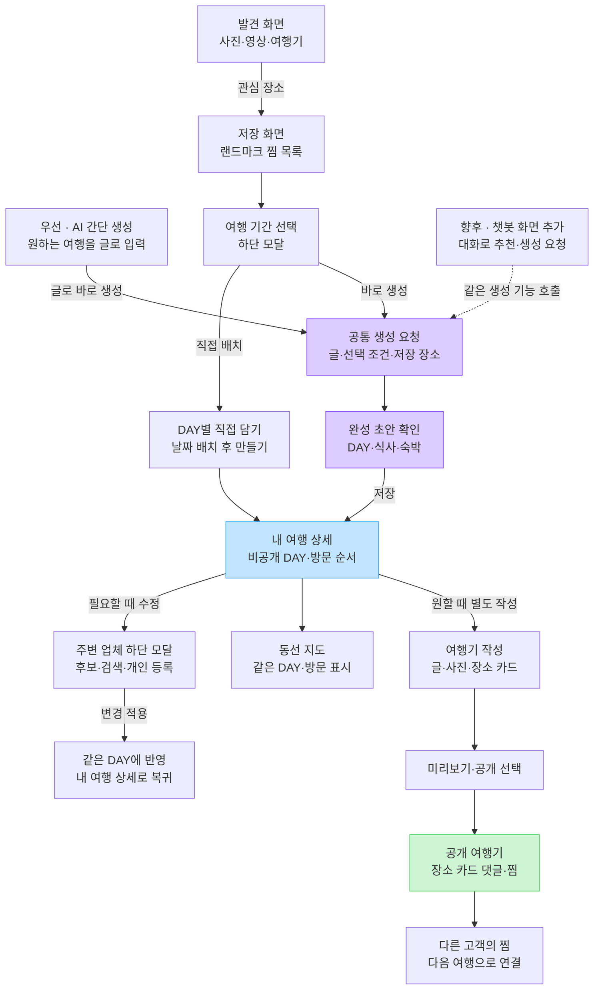
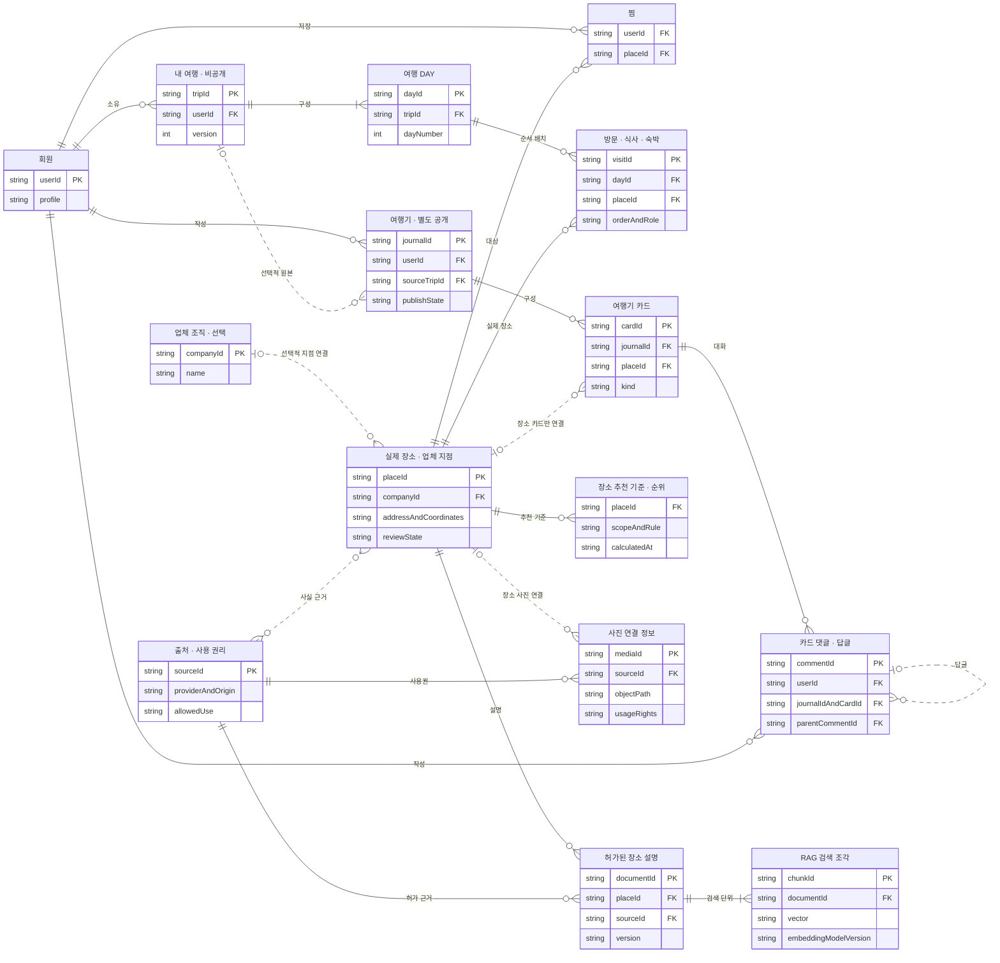
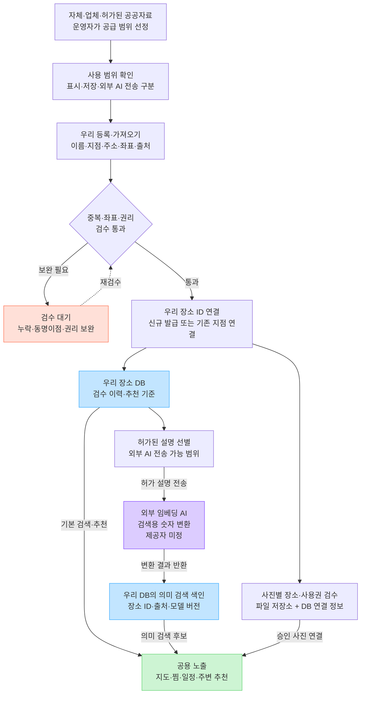
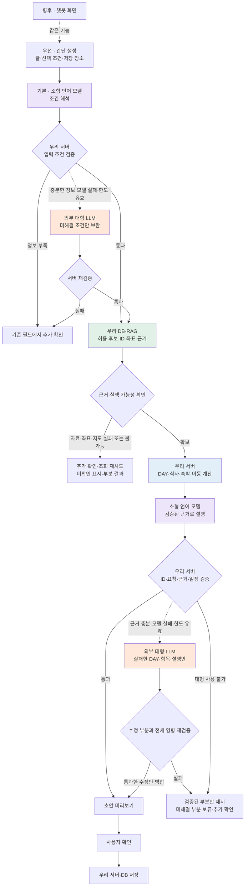
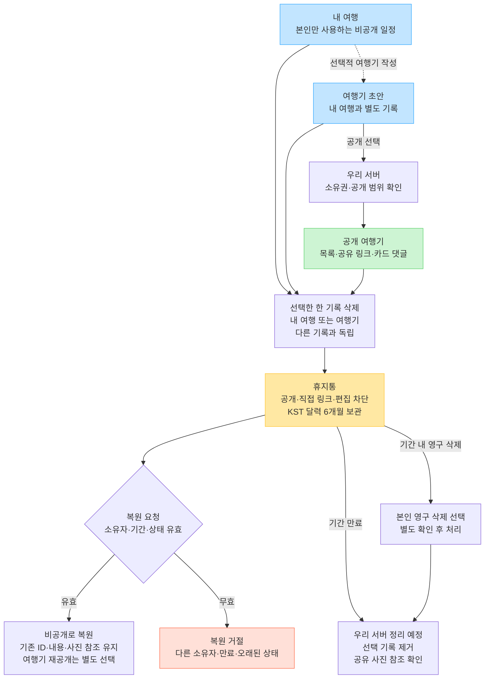
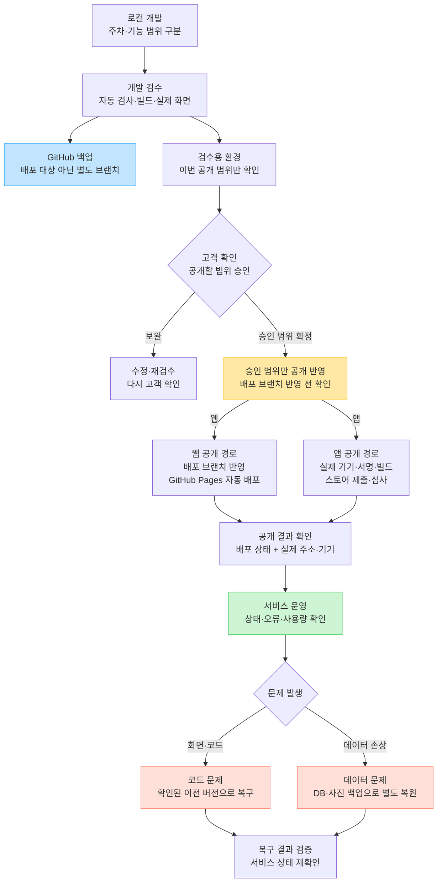

# Spotlog 추가 설계 도면 — 원고·메모·연결표

2026-09-21 · [전체 11장 목차](SYSTEM_DIAGRAM_SET_20260921.md) · 목표 설계와 현재 상태 구분

최신 적용 순서: AI 간단 생성의 글 인식·일정 생성 우선 → 안정화 후 챗봇 추가. 챗봇은 초기 출시 선행 조건 아님. [구현 순서·공통 연결 규격](AI_SIMPLE_FIRST_ROADMAP_20260921.md) 참고.

## 04 서비스 기능·화면 전환도

[FigJam 열기](https://www.figma.com/board/8IageUvocd3SaddRKOoCGi?node-id=34-1342)

우선: 글 입력·저장 장소로 간단 생성 / 향후: 챗봇 진입 추가

- 상태: 화면 시제품 있음 · 실제 로그인·AI·지도·서버 연결 예정
- 담당: 프론트 주도 · 백엔드 저장·권한 · AI 초안 연결

- **담기는 간단하게:** 기간 선택만 하단 모달 · DAY 담기는 간단 버튼 / 선택한 여행·DAY·랜드마크 맥락 유지
- **AI는 완성 초안부터:** 글에서 식사·숙박 요청 인식 → 완성 초안에 포함·제외 / 후보 선선택 강요 없음 · 상세에서 필요한 부분만 수정
- **복귀·닫기:** 입력·선택·생성 초안 보존 · 뒤로 가기 때 이전 위치 복귀 / 비공개 내 여행과 공개 여행기 내용·상태 각각 유지

## 05 데이터 관계도

[FigJam 열기](https://www.figma.com/board/8IageUvocd3SaddRKOoCGi?node-id=35-1342)

우리 DB 설계안 · 실제 서버·DB 미구축 · 확정 DDL 이전의 핵심 관계

- 상태: 제안 관계도 · 실제 테이블·연결 테이블·제약조건은 백엔드 구현 시 확정
- 담당: 백엔드 주도 · AI 색인 규격 · 운영 출처·추천 기준

- **ID의 기준:** placeId = 실제 장소·업체 지점 / companyId = 선택적 조직 / visitId = 매번의 방문 · 같은 장소 재방문도 별도 방문
- **일정·공개·댓글:** 내 여행은 비공개 · 여행기는 독립된 공개 상태 / 댓글 범위 = 여행기 ID + 장소 카드 ID · 복원은 비공개
- **사진·RAG:** 사진 원본은 저장소 · DB에는 경로·소유권·출처 연결 / 외부 임베딩 AI의 검색용 숫자 + 장소 ID·설명 버전 보관

## 06 장소·업체 데이터 등록 과정

[FigJam 열기](https://www.figma.com/board/8IageUvocd3SaddRKOoCGi?node-id=35-1353)

자료 확보부터 추천 노출까지 · 운영 검수 + 우리 서버·DB + 외부 임베딩 AI

- 상태: 우리 등록 서버·DB·외부 임베딩 AI 연결 예정 · 자료 담당·공급 범위 결정 필요
- 담당: 운영 자료·검수 / 백엔드 등록·DB / AI·RAG 색인

- **공용 자료와 개인 등록:** 좌표·출처 불명은 검수 대기 · AI의 업체·좌표 생성 없음 / 개인 등록 장소는 검수 전 본인 일정 범위
- **검색 자료의 경계:** 네이버 검색 결과의 자동 수집·DB 적재·AI 전송 제외 / 표시·저장·AI 활용 권리 각각 확인 후 허가 범위로 처리
- **갱신·실패:** 변경·철회 → DB·사진·검색 색인 함께 갱신 / 임베딩 실패 → 의미 검색 보류 · 검증된 기본 검색 유지

## 07 소형 AI 기본 처리 · 대형 LLM 예외 보완

[FigJam 열기](https://www.figma.com/board/8IageUvocd3SaddRKOoCGi?node-id=35-1364) · [호출 기준·역할·운영 정책](AI_MODEL_CASCADE_20260921.md)

소형 모델 기본 → 우리 서버 검증 → 필요한 부분만 대형 보완 → 같은 기준으로 재검증. 간단 생성 우선·챗봇 향후 추가.

- 상태: 설계안 · 모델·제공자·소형 운영 위치 미선정 · 실제 서비스 연결 전
- 담당: AI 조건 해석·설명·보완 / 백엔드 검색·일정 계산·호출 판정·검증 / 프론트 간단 입력·초안·확정 저장
- 모델 호출: 서버 판정 → 자체 운영 Flowise 실행. 아래 소형·대형 호출 모두 같은 실행 도구 경유

- **역할:** 소형 = 문장 해석·설명 / 대형 = 조건부 부분 보완 / 임베딩 AI = 의미 검색용 변환 / 서버 = 후보 조회·일정 계산·검증·저장
- **대형 제한:** 요청 전체 최대 1회가 초기 제안. 입력 단계에 사용했다면 결과 단계 추가 호출 없음. 시간·비용 한도와 실제 성능 검증 후 조정
- **데이터 기준:** 양쪽 모델 모두 우리 DB·RAG 허용 근거만 사용. 없는 업체·좌표·영업 정보 생성 금지
- **보존:** 통과한 조건·일정·예약 유지. 실패한 부분만 변경하고 전체 영향 재검증. 대형 결과도 사용자 확인 후 저장

## 08 내부·외부 연결과 실패 대응

[FigJam 열기](https://www.figma.com/board/8IageUvocd3SaddRKOoCGi?node-id=33-1278)

간단 생성부터 연결 · 향후 챗봇도 같은 연결 재사용 · API는 호출 방식

- 상태: 목표 연결 규격 · Flowise 설치 외 실제 Spotlog 서버·외부 연결 완료 아님
- 담당: 백엔드 연결·권한 / AI 모델·검색 / 프론트 재시도·상태

| 연결 대상·구분 | 우리 쪽 호출자·역할 | 보내는 정보 → 받는 결과 | 실패 시 처리 |
|---|---|---|---|
| 내부 · 우리 DB PostgreSQL PostGIS·pgvector | 우리 서버 회원·여행·장소 조회 권한·최신 버전 검증 | 회원·여행·장소 ID와 조건 → 실제 기록·좌표·순위·근거 | 저장 성공으로 표시 금지 화면 입력·초안 유지 다시 시도 · 중복 저장 방지 |
| 자체 운영 · Flowise 맥미니 기존 설치 Spotlog 연결 예정 | 우리 서버에서 호출 문장 인식·일정 생성 실행 챗봇 화면 없이도 사용 | 입력문·선택 조건·저장 장소 → 인식 조건·일정 초안 향후 대화 맥락만 추가 | 입력·정상 초안 유지 재시도 또는 수동 편집 모델·Flowise 키는 서버에 보관 |
| 언어 모델 · 소형 기본 대형은 외부 API·조건부 소형 운영 위치 미선정 | Flowise 경유·서버 판정 소형: 조건 해석·설명 대형: 실패 부분 보완 | 같은 허용 후보·근거·제약 → 조건·설명 또는 부분 수정 통과한 일정·예약 보존 | 양쪽 모델 모두 서버 검증 데이터 부족은 추가 확인 대형 실패 → 부분 결과·보류 |
| 외부 · 임베딩 AI 제공자·모델 미정 연결 예정 | 우리 서버의 등록·검색 처리 설명·질문을 검색용 숫자로 변환 | 허가 설명 또는 검색 문장 → 검색용 숫자 묶음 우리 DB에 같은 모델 규격으로 저장 | 의미 검색 실패 표시·재시도 지역·종류·거리 기반 검색 유지 미변환 자료는 색인 대기 |
| 외부 · 네이버 Maps 지도·주소·자동차 경로 연결 예정 | 지도 표시 = 우리 화면 SDK 주소·경로 조회 = 우리 서버 | 좌표·주소·출발/도착 → 지도 표시·조회 결과 지원 구간의 거리·이동시간 | 장소 목록·주소 유지 이동시간 미확인 표시 도보·대중교통 시간 임의 생성 금지 |
| 외부 · 네이버 업체 검색 API HUB 지역 검색 Maps와 별도 연결 | 우리 서버에서 호출 고객이 검색한 업체 후보 조회 | 고객 검색어·검색 조건 → 업체명·주소·분류·링크 등 | 우리 등록 장소 검색 유지 외부 검색 재시도 안내 외부 결과 자동 수집·AI 전송 제외 |
| 외부 · 파일 저장소 서비스 우리 사진 저장 영역 제공 공급자 미정 | 우리 서버 = 업로드 권한 발급 승인받은 화면 = 사진 업로드 우리 서버 = 완료·소유권 확인 | 승인된 사진 파일 → 업로드 결과·파일 주소 연결 정보·소유권은 우리 DB | 실패 사진만 재시도 작성 글·여행 초안 유지 업로드 확인 후 사진 연결 완료 |

- **AI 역할:** 소형 = 조건 인식·설명 / 대형 = 미해결 부분만 보완 / 임베딩 AI = 검색용 숫자 변환 / Flowise = 실행 도구 / 서버 = 일정 계산·검증
- **데이터 기준:** 장소 ID·좌표·순위·예약·최신 버전은 우리 DB 기준 / 외부 검색 결과의 자동 DB·RAG 적재 제외 · 사용 허가 범위로 처리
- **향후 확장:** 챗봇 화면·대화 맥락 추가 · 같은 검색·검증·저장 기능 재사용

## 09 권한·공개·삭제 처리도

[FigJam 열기](https://www.figma.com/board/8IageUvocd3SaddRKOoCGi?node-id=36-1342)

내 여행·여행기 독립 · 소유권은 우리 서버에서 확인 · 휴지통 6개월

- 상태: 휴지통 로컬 시제품 있음 · 실제 인증·서버 시각·자동 정리 연결 예정
- 담당: 백엔드 권한·만료 / 프론트 상태·복원 / 운영 신고·보관 정책

- **접근·댓글 권한:** 비회원 = 공개 여행기 열람 / 회원 = 본인 기록 관리·댓글 작성 / 댓글 수정·삭제 = 작성자 확인 · 관리·신고 권한 별도 설계
- **삭제·복원 기준:** 한국 시각 달력 6개월 · 만료 시각부터 복원 차단 / 일정·여행기·찜 각각 독립 · 복원 내용과 편집 초안도 비공개
- **서버 정책 결정 필요:** 공유 사진·댓글 연관 정리 · 계정 탈퇴 · 백업 보관 기간 / 사용자 휴지통 6개월과 장애 복구용 백업은 별도

## 10 개발·검수·배포·운영 흐름도

[FigJam 열기](https://www.figma.com/board/8IageUvocd3SaddRKOoCGi?node-id=36-1353)

코드 백업·고객 검수·공개 배포 분리 · 현재 웹 배포 경로 + 향후 서버·앱 운영

- 상태: 웹 Pages 배포 경로 있음 · 승인 강제 게이트·서버 운영·앱 스토어 연결 완료 아님
- 담당: 개발 검수·배포 / 고객 공개 범위 확인 / 운영 장애·복구

- **백업과 공개:** 현재 codex/mobile-foundation push 또는 수동 실행 → 웹 자동 배포 / 별도 백업 브랜치로 사이트 배포와 분리 · 공개 전 범위 확인
- **검수와 실제 공개:** 로컬 검사 성공과 공개 성공 각각 확인 / 승인한 주차·파일만 반영 · 미공개 작업이 섞이지 않게 관리
- **복구·운영 결정:** Git 코드 백업과 고객 DB·사진 백업은 별개 / 호스팅·모니터링·백업 보존·복구 목표·담당자 결정 필요

## 설계 근거

- AI_NAVER_START_GUIDE_20260920.md, FLOWISE_CHAT_ITINERARY_PLAN_20260920.md
- AI_RAG_IMPLEMENTATION_20260920.md, AI_COMPLETE_ITINERARY_DIRECTION_20260920.md
- NAVER_MAPS_IMPLEMENTATION_20260920.md, ../DATA_SUPPLY_AND_NAVER_PLAN.md
- TRASH_USER_FLOW.md, PHASE_2_IMPLEMENTATION_PLAN.md의 확정 사용자 방향
- web/src/data.ts, cardSocialState.ts, tripTrash.ts 및 .github/workflows/deploy-pages.yml 대조

사진의 사용자·카드 연결, 출처와 장소의 다대다 연결, 실제 PK/FK·연결 테이블·삭제 참조 정책은 서버 상세 설계에서 확정. 의미 검색용 벡터는 임베딩 모델·차원·버전에 맞춰 관리.
